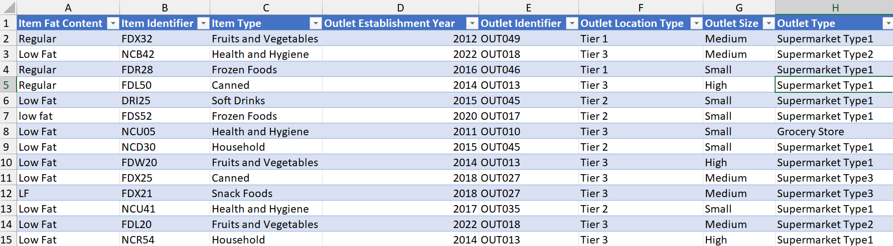

# Sales Analysis For Freshmart

## Business Context
FreshMart is a national grocery chain experiencing inconsistent sales across outlet locations. Management seeks insights to optimize product inventory, improve sales performance, and realign outlet strategies.

## Objective of the Analysis
To analyze item-level sales data across outlet locations and uncover patterns in product performance, customer preferences, and outlet productivity.

## Data Overview
The dataset includes information on items sold (Item Type, Fat Content, Visibility, Weight), outlet details (Location Tier, Size, Establishment Year, Type), and item-level sales performance.

## Key Findings
- Low Fat items contribute over 60% of sales across all locations, indicating health-conscious consumer behavior.
- Tier 3 outlets have the highest average sales despite smaller sizes.
- Supermarket Type1 consistently outperforms Grocery Stores in total sales and variety.

## Dashboard
